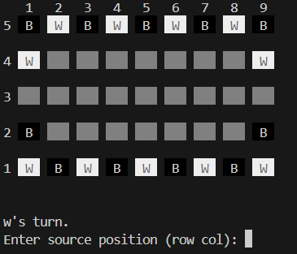
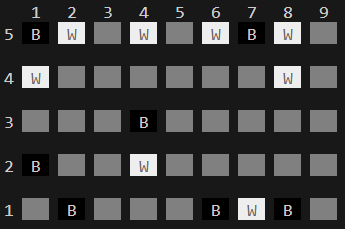

## PFL_TP2_T10_Collapse_2

Trabalho realizado por:
- Ana Sofia Costa das Neves Baptista (up202207334)
- Martim Teixeira Elói Moniz (up202206958)

Contribuição para o Trabalho:

- Ana Sofia Baptista: 50% Funções Implementadas: initial_state; display_game; game_over; value; choose_move
- Martim Moniz: 50% Funções Implementadas: initial_state; display_game; move; valid_moves; choose_move

### Instalação e Execução

- $ sicstus 
- ?- [game].
- ?- [menu].
- ?- menu.

### Descrição do Jogo

Collapse é um jogo de tabuleiro para dois jogadores em que o principal objetivo é capturar as peças do adversário colidindo com elas e evitar que o oponente capture no seu turno. Joga se num tabuleiro 9x5 e os jogadores definem quem será responsável pelas peças pretas e pelas brancas. Estas são posicionadas, de forma alternada, em ambos os lados com 9 posições e no lado de 5 apenas é adicionada uma de cada lado.

#### JOGABILIDADE
O jogador branco faz o primeiro movimento e depois são alternados os turnos. O jogador ativo deve mover uma peça da sua cor e
capturar exatamente uma peça do oponente. A peça move-se sempre em linha reta no tabuleiro até
bater numa peça do oponente. Ela não pode mudar de direção nem se mover numa direção onde não haja peça do oponente.
Após o movimento, a peça do oponente com a qual a peça do jogador ativo bate é capturada e removida do jogo.

#### FIM DO JOGO
O jogador que não conseguir fazer uma captura na sua vez perde o jogo.

### Lógica do Jogo

#### Representação da Configuração do Jogo

A configuração do jogo é representada pela configuração inicial do tabuleiro e pelos modos de jogador. O tabuleiro inicial é definido usando uma lista de listas, onde cada sublista representa uma linha do tabuleiro. Cada elemento na sublista representa uma célula, que pode ser uma peça (b para preto, w para branco) ou uma célula vazia (e). O predicado initial_board/1 inicializa o tabuleiro com a configuração inicial. Os modos de jogador (Jogador vs Jogador, Jogador vs Computador, Computador vs Computador) e os níveis de dificuldade são geridos usando predicados dinâmicos.

Representação do Estado Interno do Jogo
O estado do jogo é representado pela configuração atual do tabuleiro e pelo jogador atual. O tabuleiro é uma lista de listas, onde cada sublista representa uma linha, e cada elemento na sublista representa uma célula. As células podem conter:

- b: Peça preta
- w: Peça branca
- e: Célula vazia
  
#### Exemplos de estados do jogo:

#### Estado Inicial:

#### Estado Intermédio:

#### Estado Final:

#### Representação dos Movimentos

Um movimento é representado pelas coordenadas das células de origem e destino, e pela célula final após capturar uma peça do adversário. As coordenadas são representadas como tuplos (Linha, Coluna). O predicado move/3 usa estas coordenadas para atualizar o estado do tabuleiro. Por exemplo, um movimento de (1, 1) para (2, 2) com uma aterragem final em (3, 3) é representado como:

move(Board, (1, 1), (2, 2), (3, 3), NewBoard).

#### Interação com o Utilizador

O sistema de menus do jogo oferece opções para os modos Jogador vs Jogador, Jogador vs Computador e Computador vs Computador. A interação com o utilizador é gerida através de uma série de prompts e entradas. A validação de entradas assegura que o utilizador fornece coordenadas e movimentos válidos. Por exemplo, ao ler um movimento, o sistema verifica se as coordenadas inseridas estão dentro do intervalo válido e se o movimento é legal de acordo com as regras do jogo. O sistema de menus e a validação de entradas são implementados usando predicados que leem a entrada do utilizador, a validam e fornecem feedback ou solicitam nova entrada, se necessário.

### Conclusão
O jogo Collapse foi implementado com sucesso, através da linguagem Prolog. Dispõe de vários modos de jogo - Player vs Player, Player vs Computer, Computer vs Player e Computer vs Computer - tendo os Computers 2 níveis de dificuldade. 

### Bibliografia
As regras do jogo foram consultadas neste site:
- [Collapse_Rules](https://cdn.shopify.com/s/files/1/0578/3502/8664/files/Collapse_EN.pdf?v=1713463846)
- Foi também usado Chatgpt no sentido de ajudar a fazer debugging em certas funções do código.

